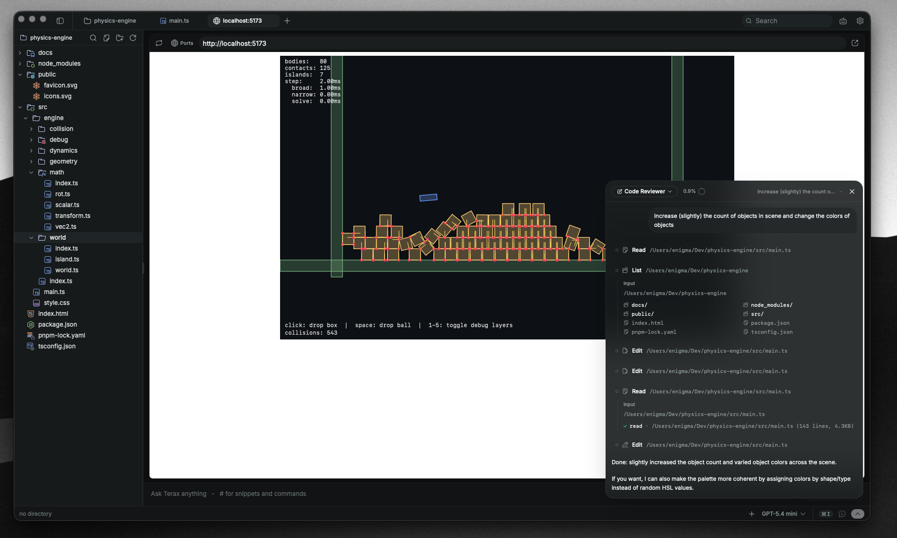
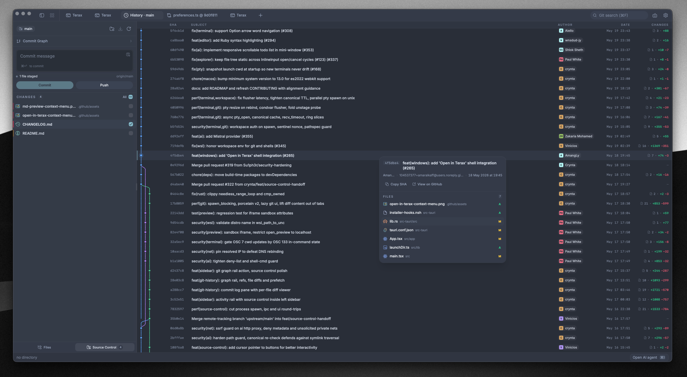

<div align="center">
  
  <h1>Terax</h1>

  <p><strong>轻量、终端优先的 AI 原生开发工作区。</strong></p>

  <p>
    
    
    
    <a href="https://discord.gg/tyveTUyEp7"></a>
  </p>

  <p>
    <a href="https://terax.app">官网</a>
    ·
    <a href="https://terax.app/docs">文档</a>
    ·
    <a href="https://github.com/crynta/Terax-website">官网源码</a>
  </p>
</div>

---

> 本文档为 [README.md](README.md) 的中文译本，仅供阅读参考。以英文原文为准。

Terax 是基于 Tauri 2 + Rust 与 React 19 构建的轻量开源终端（ADE）。原生 PTY 后端 + WebGL 渲染，Agent 式 AI 侧栏（自备 API 密钥或完全本地模型），内置代码编辑器、文件浏览器、带 git 图的源码控制、Web 预览面板。磁盘约 7-8 MB。无遥测。无需账号。

## 截图

<table>
  <tr>
    <td align="center"><br/><sub>多标签终端与 WebGL 渲染</sub></td>
    <td align="center"><br/><sub>自定义主题、预设与背景图</sub></td>
  </tr>
  <tr>
    <td align="center"><br/><sub>本地开发服务器 Web 预览</sub></td>
    <td align="center"><br/><sub>源码控制面板与历史中的 git 图</sub></td>
  </tr>
  <tr>
    <td colspan="2" align="center"><br/><sub>Agent 式 AI 工作流与编辑器中的编辑 diff</sub></td>
  </tr>
</table>

## 功能

### 终端

- xterm.js + WebGL 渲染，多标签后台流式输出
- GPU 加速块状终端，类编辑器的命令输入
- 经 `portable-pty` 的原生 PTY 后端（zsh、bash、pwsh、fish、cmd）
- 分屏（水平与垂直）
- 行内搜索、链接检测、真彩色
- Windows 上每标签工作区环境（本地或任意已装 WSL 发行版）

### 代码编辑器

- CodeMirror 6（支持主流语言：TS/JS、Rust、Python、Go、C/C++、Java、HTML/CSS、JSON、Markdown 等）
- 行内 AI 自动补全，支持本地模型
- AI 编辑 diff，按 hunk 接受或拒绝
- Vim 模式
- 十种内置编辑器主题：Atom One、Aura、Copilot、GitHub Dark / Light、Gruvbox Dark、Nord、Tokyo Night、Xcode Dark / Light

### 源码控制

- 暂存/取消暂存 hunk、提交（Cmd+Enter / Ctrl+Enter）、带上游感知的推送
- 分支显示（含 detached HEAD）
- Git 历史面板与真实提交图（合并与分支的车道渲染）
- 提交搜索与筛选，可跳转远程提交页

### 文件浏览器

- Catppuccin 图标主题
- 模糊搜索、键盘导航、行内重命名、上下文操作
- 可将文件与选区直接附加到 AI 侧栏

### Web 预览

- 自动检测本地开发服务器并在预览标签打开
- 经原生子 webview 的外部 URL 预览

### 主题与自定义

- 应用内构建自定义主题，在捆绑预设与自有主题间切换
- 创建、分享或从社区导入主题
- 背景图，可调透明度与模糊
- 编辑器主题与应用主题独立

### AI

- **BYOK 提供商**：OpenAI、Anthropic、Google（Gemini）、Groq、xAI（Grok）、Cerebras、OpenRouter、DeepSeek、Mistral，及任意 OpenAI 兼容端点
- **本地/离线**：LM Studio、MLX、Ollama
- **Agent 工作流**：计划、子 Agent、经 `TERAX.md` 的项目记忆，文件读/写/编辑/多编辑/grep/glob，带审批的 bash、后台进程
- **Composer**：`#handle` 片段、`@path` 文件、斜杠命令、语音输入，从浏览器或选区附加到 Agent
- **自定义 Agent**，独立系统提示与工具子集
- **计划模式**，多步工作先生成计划再确认执行

## 安装

最新安装包见 [Releases](https://github.com/crynta/terax-ai/releases/latest)。Terax 由此自动更新。

### Windows 说明

- 首次启动 Windows 可能显示「Windows 已保护你的电脑」，因 Terax 尚未代码签名。点 **更多信息** 再 **仍要运行**。
- 默认 Shell 检测：`pwsh.exe`（PowerShell 7+）→ `powershell.exe`（Windows PowerShell 5.1）→ `cmd.exe`。
- WSL 是一等工作区环境，非包装子进程。

### Linux 说明

- **Arch / AUR**：`yay -S terax-bin`（或 `paru` 等），跟踪最新发布。
- **NixOS / Nix**：官方 flake - `nix profile install github:crynta/terax-ai`（非 NixOS），或导入 flake 并将 `inputs.terax.packages.${pkgs.system}.terax` 加入 `environment.systemPackages`（NixOS）。也可用 `nixosModules.terax`。
- **AppImage**：需要 FUSE。无 FUSE：`./Terax_*.AppImage --appimage-extract-and-run`。Wayland 渲染异常可试 `WEBKIT_DISABLE_DMABUF_RENDERER=1`。否则 `.deb` / `.rpm` 链系统 GTK 栈通常更顺滑。

## 配置 AI

1. 打开 **设置 → AI**。
2. 选择提供商并粘贴 API 密钥。本地推理则指向 LM Studio / MLX / Ollama 端点。
3. 密钥经 `keyring` 写入 OS 钥匙串，不落盘或 localStorage。

## 从源码构建

**前置条件**
- Rust（stable），https://rustup.rs
- Node 20+ 与 [pnpm](https://pnpm.io)
- 各平台 [Tauri 前置依赖](https://tauri.app/start/prerequisites/)

**运行**
```bash
pnpm install
pnpm tauri dev          # 开发
pnpm tauri build        # 生产打包
```

**检查**
```bash
pnpm lint
pnpm check-types
pnpm test
cd src-tauri && cargo clippy --all-targets --locked -- -D warnings   # Rust lint（与 CI 一致）
cd src-tauri && cargo nextest run --locked                           # 或：cargo test --locked
```

## 技术栈

Tauri 2、Rust、`portable-pty`、React 19、TypeScript、Vite、xterm.js、CodeMirror 6、Vercel AI SDK v6、Tailwind v4、shadcn/ui、Zustand。

## 贡献

欢迎 Issue 与 PR！详见 [CONTRIBUTING.md](CONTRIBUTING.md)（中文译本：[CONTRIBUTING.zh-CN.md](CONTRIBUTING.zh-CN.md)）。

## 许可证

Terax 采用 Apache-2.0。依赖信息见 [Apache License 2.0](LICENSE)。

## Star 历史

<div align="center">
  <a href="https://www.star-history.com/#crynta/terax-ai&Date">
    <picture>
      <source media="(prefers-color-scheme: dark)" srcset="https://api.star-history.com/svg?repos=crynta/terax-ai&type=Date&theme=dark" />
      <source media="(prefers-color-scheme: light)" srcset="https://api.star-history.com/svg?repos=crynta/terax-ai&type=Date" />
      
    </picture>
  </a>
</div>
