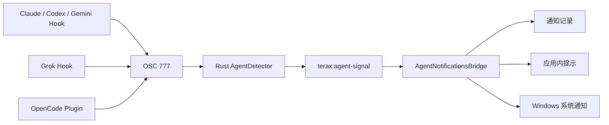

# Terax Windows 个人改造规格

## 1. 目标

本规格定义个人 Fork 中的 Windows 小范围改造，目标如下：

1. 让 Windows 终端的 `Ctrl+C`、`Ctrl+V` 符合 Windows Terminal 的常用行为。
2. 在不删除英文界面的前提下，增加可切换的简体中文界面。
3. 在 Windows 上可靠接收 Claude Code、Codex、Gemini、Grok 和 OpenCode 的完成及注意事件。
4. 将个人改动与上游代码隔离，降低后续同步新版本时的冲突和重复打包成本。

所有实现必须遵守现有 Tauri、React、TypeScript、Rust 和 Zustand 架构，不新增依赖，不改变 macOS、Linux 的既有行为。

## 2. 非目标

- 不翻译终端输出、Agent 输出、AI 提示词、模型名称、命令、开发日志和 Rust 技术错误。
- 不汉化 NSIS/MSI 安装程序。
- 不实现运行时 DOM 文本替换、外部注入脚本或独立插件系统。
- 不分析终端可见文本来猜测 Agent 是否完成。
- 不增加后台服务、数据库、遥测或网络接口。
- 不在本规格中定义向上游提交 PR 的流程。

## 3. 分支与更新策略

个人仓库使用以下分支关系：

- `origin`：个人 Fork `https://github.com/wwwhappyst/terax-ai.git`。
- `upstream`：原作者仓库 `https://github.com/crynta/terax-ai.git`。

```text
upstream/main
    └── codex/windows-enhancements
          ├── Windows 终端快捷键
          ├── i18n 基础层
          ├── 简体中文翻译
          ├── Agent 通知行为
          └── Grok/OpenCode 适配
```

- `main` 只跟踪原作者上游，不承载个人功能提交。
- 个人功能按子系统拆成独立提交，禁止把汉化、快捷键和通知混入同一个提交。
- 同步上游时，将个人分支 rebase 到最新 `upstream/main`。
- 允许使用 Git `rerere` 复用已经解决过的冲突，但不得用脚本静默覆盖冲突文件。
- 个人构建不得继续使用原作者的自动更新源。个人发布与签名流程建立前，关闭内置自动更新；建立后再改为个人仓库的签名 Release。

## 4. Windows 终端快捷键

### 4.1 行为

Windows 终端键盘事件必须按下表处理：

| 输入 | 条件 | 行为 |
| --- | --- | --- |
| `Ctrl+C` | xterm 存在文本选区 | 将选区写入剪贴板，不向 PTY 发送中断 |
| `Ctrl+C` | xterm 没有文本选区 | 不拦截事件，由 xterm 向 PTY 发送中断控制字符 |
| `Ctrl+V` | 任意终端状态 | 从剪贴板读取文本并通过 `xterm.paste()` 粘贴 |
| `Ctrl+Shift+C` | 任意终端状态 | 保留现有复制行为 |
| `Ctrl+Shift+V` | 任意终端状态 | 保留现有粘贴行为 |

### 4.2 实现边界

- 快捷键判断位于终端渲染池的自定义键盘事件处理器中，不针对具体 Agent CLI 编写分支。
- 平台判断复用 `src/lib/platform.ts` 的 `IS_WINDOWS`，不再新增 User-Agent 判断。
- 复制和粘贴复用现有 `terminalClipboard.ts`，不得引入新的剪贴板实现。
- Windows 的普通 `Ctrl+V` 会覆盖终端程序对控制字符 `^V` 的使用，这是本规格明确选择的 Windows 桌面行为。
- macOS 和 Linux 继续使用原有快捷键语义。

## 5. 界面国际化

### 5.1 语言模型

界面支持以下语言值：

```ts
type AppLanguage = "en" | "zh-CN";
```

- 默认值为 `en`，确保未配置用户和上游行为保持不变。
- 语言值存入现有偏好设置 Store，并复用现有跨窗口偏好变更事件。
- 主窗口和设置窗口切换语言后立即刷新，不要求重启应用。
- 页面根元素的 `lang` 属性与当前语言同步。

### 5.2 翻译结构

新增轻量 i18n 模块，不引入第三方库：

```text
src/modules/i18n/index.ts
src/modules/i18n/zh-CN.ts
```

英文原文同时作为默认文本和翻译键：

```tsx
t("Open settings")
```

- 英文模式直接返回原文。
- 中文模式从 `zh-CN.ts` 查询翻译。
- 缺少中文翻译时返回英文原文，不抛出异常，不阻断界面渲染。
- 动态参数仅支持字符串和数字占位符，不建立复数规则框架。
- 日期、数字和相对时间优先使用浏览器原生 `Intl`，语言参数使用当前界面语言。
- React 组件使用订阅语言偏好的 Hook；Toast 等命令式调用使用读取当前语言的纯函数。

### 5.3 覆盖范围

中文模式必须覆盖正常可见界面，包括：

- 主窗口菜单、标签页、侧边栏、文件浏览器、编辑器和预览区控件。
- 设置窗口的标签、标题、说明、选项和按钮。
- 弹窗、空状态、确认信息、Toast 和 Agent 通知。
- `title`、`placeholder`、`aria-label` 等可见或无障碍文本。
- 快捷键名称、状态文字和相对时间。

以下内容保持原值：

- 文件名、路径、Shell 名称、模型名称、主题名称和协议标识符。
- 终端、Agent、AI 返回的内容。
- Rust 返回的技术错误、控制台日志和调试信息。

不得使用 MutationObserver 或遍历 DOM 的方式翻译页面。所有正常界面文本必须在组件渲染时通过 i18n 层取得。

## 6. Agent 通知

### 6.1 通知链路

所有外部 Agent 使用统一的命名 OSC 标记进入现有检测和通知链：



OSC 格式保持为：

```text
ESC ] 777 ; notify ; Terax ; <agent> ; <event> BEL
```

`<agent>` 只允许 `claude`、`codex`、`gemini`、`grok`、`opencode`；`<event>` 只处理 `working`、`attention`、`finished`。未知名称或事件必须忽略。

### 6.2 Agent 事件映射

| Agent | 配置位置 | 工作事件 | 注意事件 | 完成事件 | 传递方式 |
| --- | --- | --- | --- | --- | --- |
| Claude Code | `~/.claude/settings.json` | `UserPromptSubmit` | `Notification` | `Stop` | `terminalSequence` |
| Codex | `~/.codex/hooks.json` | `UserPromptSubmit` | `PermissionRequest` | `Stop` | Windows `CONOUT$` 辅助入口 |
| Gemini | `~/.gemini/settings.json` | `BeforeAgent` | `Notification` | `AfterAgent` | Windows `CONOUT$` 辅助入口 |
| Grok | `~/.grok/hooks/terax.json` | `UserPromptSubmit` | `Notification` | `Stop` | Windows `CONOUT$` 辅助入口 |
| OpenCode | `~/.config/opencode/plugins/terax-agent-notifications.js` | 不要求 | `permission.asked` | `session.idle` | 插件向 stdout 写入 OSC |

Grok 适配遵循 xAI 官方 Hook 协议：<https://docs.x.ai/build/features/hooks>。

OpenCode 适配遵循官方插件事件协议：<https://opencode.ai/docs/plugins/>。

OpenCode 只依赖完成和权限事件；不为显示“工作中”状态额外推断消息或工具调用。`session.idle` 每次代表一次任务完成，由现有 AgentDetector 负责把命名标记关联到当前 PTY。

### 6.3 Hook 安装与状态

- 用户只有在通知铃中明确点击“启用”后，Terax 才能写入对应 Agent 配置。
- Claude、Codex、Gemini 和 Grok 使用现有 JSON 解析、保留外部 Hook、原子写入和幂等合并原则。
- Grok 使用 Terax 专用文件，但仍需解析并保留其中非 Terax 内容；无效 JSON 时拒绝覆盖。
- OpenCode 使用 Terax 专用插件文件。若同名文件存在但没有 Terax 所有权标记，必须拒绝覆盖并显示错误。
- 状态检查只返回布尔状态或可显示错误，不把完整 Agent 配置返回给前端。
- Windows Hook 状态必须确认命令指向当前有效的 Terax 可执行文件。开发版、正式版或安装目录变化后，旧路径不得被误报为已启用。
- Hook 命令继续使用 `TERAX_TERMINAL` 环境变量限制作用范围，避免在其他终端中向 Terax 发送标记。
- Hook 安装失败必须显示明确的应用内错误，禁止静默失败。

### 6.4 通知路由

启用“Coding agent notifications”后，每个有效事件先写入通知记录，再根据窗口状态决定是否弹出：

| Terax 状态 | 当前 Agent 可见性 | 行为 |
| --- | --- | --- |
| 最小化或失焦 | 任意 | 记录通知并发送 Windows 系统通知 |
| 前台 | Agent 位于其他标签页或面板 | 记录通知并显示应用内提示 |
| 前台 | 当前正在查看 Agent | 只记录通知，不弹出提示 |

- `attention` 和 `finished` 均遵循上述路由。
- 通知设置关闭时，不新增通知记录，也不发送系统或应用内提示。
- 系统通知权限被拒绝或调用失败时，不影响通知记录和应用稳定性；技术原因写入开发日志。

## 7. 组件职责

| 组件 | 职责 |
| --- | --- |
| `rendererPool.ts` | Windows 终端复制、粘贴和 PTY 事件放行 |
| `terminalClipboard.ts` | 现有剪贴板读写，不扩展职责 |
| `modules/i18n` | 翻译查询、占位符替换、当前语言读取 |
| `modules/settings/store.ts` | 持久化语言偏好并广播跨窗口变化 |
| `GeneralSection.tsx` | 提供界面语言选择 |
| `agent.rs` | 安装和检查五种 Agent 的 Hook/插件配置 |
| `agent_detect.rs` | 解析受信任格式的命名 OSC Agent 事件 |
| `AgentNotificationsBridge.tsx` | 将 PTY Agent 事件转换为统一通知请求 |
| `route.ts` | 记录通知并依据焦点和可见性选择通知方式 |
| `NotificationBell.tsx` | 展示通知历史、五种 Agent 的启用状态和安装错误 |

不得为每个 Agent 建立独立通知管线。除 OpenCode 插件文件格式不同外，新增 Agent 必须尽量复用现有 `AgentSpec`、OSC 和通知路由。

## 8. 安全与数据保护

- 不读取、记录或展示 Agent 配置中的 API Key、Token 或其他无关字段。
- 日志不得输出完整 Agent 配置文件或 Hook 进程环境变量。
- 写配置前必须成功解析原文件；解析失败时停止，不覆盖用户内容。
- 配置写入继续采用同目录临时文件加重命名，避免崩溃造成截断。
- Hook/插件只负责向当前 Terax PTY 发送固定事件，不执行网络请求，不传输会话内容。
- PTY 输出属于不可信输入；Rust 检测器必须维持 Agent 白名单和事件白名单。

## 9. 兼容性要求

- 不新增前端、Rust 或系统依赖，不修改锁文件。
- 不改变现有偏好设置键的含义，新增语言字段必须具有英文默认值。
- 不改变 macOS/Linux 的快捷键和剪贴板行为。
- 不破坏已有 Claude、Codex、Gemini Hook，重复启用不得产生重复 Hook。
- 上游新增英文界面在缺少中文翻译时必须正常显示英文。
- 个性化版本不得从原作者更新源安装二进制更新。

## 10. 验收标准

### 10.1 Windows 快捷键

- PowerShell 中无选区按 `Ctrl+C` 能中断前台命令。
- 有终端选区时按 `Ctrl+C` 能复制且不向 CLI 发送中断。
- `Ctrl+V` 能粘贴英文、中文和多行内容。
- 五种 Agent CLI 中的行为与普通 PowerShell 一致。

### 10.2 简体中文

- English 与简体中文可在设置中切换，两个窗口立即同步。
- 正常可见界面不存在因缺失翻译导致的空文本、键名或异常。
- 中文模式下，终端、Agent 输出、技术日志和模型名称保持原值。

### 10.3 Agent 通知

- 五种 Agent 均可在通知铃中检查和启用适配。
- 每种 Agent 完成一次任务时只产生一次 `finished` 通知记录。
- 失焦、前台隐藏、前台可见三种场景符合通知路由表。
- Agent 配置无效、文件冲突或 Hook 路径失效时给出明确错误且不覆盖原文件。

### 10.4 工程验证

- TypeScript 类型检查和现有前端 Lint 通过。
- 现有前端测试、Rust 单元测试和 Clippy 检查通过。
- Windows 开发运行中完成快捷键、语言切换和五种 Agent 通知的人工验收。
- 未产生未列明的依赖、缓存、临时配置或构建产物。
